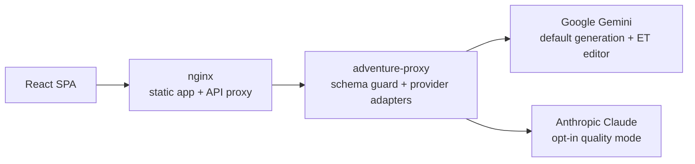

# AI Adventure Engine

[](https://github.com/khelias/khe-ai-adventure/actions/workflows/ci.yml)
[](https://github.com/khelias/khe-ai-adventure/actions/workflows/codeql.yml)
[](https://github.com/khelias/khe-ai-adventure/actions/workflows/deploy.yml)

A party adventure game for 3-6 players around one phone, live at
[games.khe.ee/adventure](https://games.khe.ee/adventure/).

One person reads the story aloud, the group debates the next move, and the AI
continues the adventure. It is built for a real table: fast setup, private
objectives revealed by passing the phone, shared pressure everyone can see,
and short turns that keep the room moving.

## Why it exists

It is both a playable game and a reference for AI-backed consumer software
with clear boundaries. The interesting parts are not "call an LLM":

- AI output is constrained by canonical schemas and a proxy-side allowlist.
- The engine owns the mechanics: the model narrates, the app applies the
  shared state and scores the secret goals.
- Cost is a product requirement: a cheap, fast model by default, a stronger
  one only as an opt-in quality mode.
- Estonian prose gets a separate editor pass, because good local language
  matters more than raw model impressiveness.
- Prompts, model choice and the API contract are documented as engineering
  decisions.



The browser never calls a provider. The Node proxy holds the keys, checks
request signatures, enforces the schema allowlist and logs model telemetry.

## Running it

```bash
npm install
npm run dev
npm run ui:smoke
```

The dev server proxies `/adventure/api/` to the live endpoint, which needs the
HMAC secret. To play without it or without spending model credits, open the
setup screen's `AI` panel and pick `Mock`: it runs in the browser and returns
the same response shapes as the live providers. `ui:smoke` runs the same mock
flow headlessly with Playwright. Every other command and the quality gate are
in [AGENTS.md](AGENTS.md).

## Where it runs

Every push to `main` deploys through a self-hosted runner on the homelab VM:
static assets to the games nginx mount and a rebuilt proxy container. The
infrastructure is in [khe-homelab](https://github.com/khelias/khe-homelab);
this repo owns the app, proxy, prompts, contracts and product docs.

## More

- [docs/README.md](docs/README.md) - documentation index: architecture, API
  contract, UI/UX, model strategy, prompt audit
- [docs/decisions/](docs/decisions/README.md) - architecture decision records
- [AGENTS.md](AGENTS.md) - commands, layout and invariants for working on the
  code
- [ROADMAP.md](ROADMAP.md) - playtest gates and what comes next

MIT licensed.
